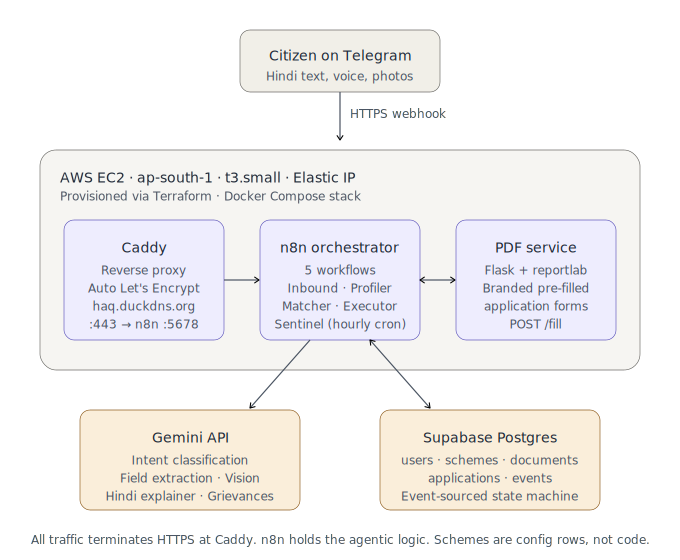

# Haq — हक़

**The AI agent that claims, tracks, and fights for what is rightfully yours.**

> 800 million Indians are owed $210B in benefits across 13,000+ welfare schemes.
> Most never claim it — not because they don't qualify, but because nobody helps them
> navigate the bureaucracy. Haq is a Personal Institutional Agent that represents
> ordinary citizens, autonomously, the way a CA represents the wealthy.

**Live demo:** [t.me/haqadhikarbot](https://t.me/haqadhikarbot) · message it in Hindi or English.

---

## Why

A University of Chicago field experiment with 1,200+ pension-eligible widows in Delhi found:
*information alone* helped only the literate few — *hands-on mediation* was what actually moved money into the hands of the most vulnerable. Today that mediation is done by expensive human agents at hundreds of rupees per application. Haq does it as AI, at under ₹10 per application.

Existing players stop at discovery (MyScheme, EasyGov) or use human field-agents (Haqdarshak). **Nobody built the agentic layer** — a system that autonomously fills forms, pulls documents, tracks status over weeks, follows up with departments, and escalates rejections, end-to-end. That's what Haq is.

## What it does today (V0)

A live, deployed Telegram bot that:

- **Understands Hindi text and document photos.** Send a voice description or an Aadhaar photo — fields are extracted and a profile built.
- **Matches you to real schemes.** A deterministic eligibility engine (zero LLM at decision time, zero hallucination) ranks 12 real Rajasthan + Central welfare schemes by `payout ÷ effort`.
- **Explains in fluent Hindi.** Top matches arrive in plain language with exact rupee amounts.
- **Generates a branded, pre-filled government-style PDF** on consent, ready to print, sign, and submit.
- **Tracks the application as a state machine** stored as an event-sourced log in Postgres.
- **Auto-drafts a CPGRAMS grievance letter** when a department misses its statutory decision window. Sentinel cron runs hourly to detect breaches and act on the user's behalf.
- **Scales as configuration.** Adding scheme #500 is one `INSERT` on the `schemes` table, not a code deploy.

## Architecture



| Component | Role |
|---|---|
| **Telegram** | Channel layer (WhatsApp Business is the V1 target — Telegram is V0 because it needs no approval). |
| **Caddy** | TLS termination via automatic Let's Encrypt; reverse-proxies to n8n. |
| **n8n** | Orchestration — 5 workflows (Inbound, Profiler, Matcher, Executor, Sentinel) over Postgres. |
| **Gemini 3.5 Flash** | Vision (document OCR), intent classification, vernacular Hindi explainer, grievance drafting. Used only where reasoning is needed — never for eligibility decisions. |
| **Eligibility engine** | Pure deterministic JavaScript inside an n8n code node. Annualizes benefits (monthly × 12, insurance × 0.01) and ranks by `score ÷ effort`. No LLM tokens at runtime. |
| **PDF service** | Flask + reportlab. POST `/fill` returns a branded, pre-filled application form per scheme. |
| **Supabase Postgres** | The state layer: `users`, `schemes` (JSONB configs), `documents`, `applications` (state machine), `events` (append-only log). |
| **AWS EC2 t3.small** | Single Mumbai-region instance running the Docker stack (n8n + pdf + caddy). Provisioned via Terraform. |

### The state machine (the agent's soul)

What separates an agent from a chatbot is unprompted action over weeks. Every application advances through:

```
discovered → eligible → docs_pending → ready → submitting
        → awaiting_otp → submitted → acknowledged → under_review
        → approved → disbursed
```

Branches: `rejected → remediation → resubmitted` and `stalled → grievance_filed → escalated`.

Every transition is atomic and logged: a single Postgres function `transition(app_id, new_state, deadline, payload)` updates the row and inserts an event in one shot. The Sentinel cron sweeps for breached `deadline_at` values hourly and acts — sending reminders, drafting grievances, escalating.

### Why "scheme as config, not code" matters

Each scheme is a row in the `schemes` table with a versioned JSONB config:

```json
{
  "id": "rj_widow_pension",
  "version": 1,
  "name": {"en": "Widow Pension (Rajasthan)", "hi": "विधवा पेंशन (राजस्थान)"},
  "benefit": {"type": "monthly_cash", "amount_inr": 1500},
  "effort_score": 2,
  "eligibility": {"all": [
    {"field": "gender", "op": "eq", "value": "female"},
    {"field": "marital_status", "op": "eq", "value": "widowed"},
    {"field": "age", "op": "gte", "value": 18},
    {"field": "annual_income", "op": "lte", "value": 48000},
    {"field": "state", "op": "eq", "value": "RJ"}
  ]},
  "required_docs": [...],
  "execution": {...},
  "slas": {"acknowledge_days": 7, "decision_days": 45},
  "appeal": {"route": "cpgrams", "grievance_dept": "..."}
}
```

Onboarding a new scheme = `INSERT INTO schemes(id, version, config) VALUES (...)`. Adding scheme #500 means adding a config file, not engineering — the demo's most memorable moment is doing this live in 30 seconds.

## Repository layout

```
haq/
├── infra/              # Terraform — AWS EC2, VPC, security group, Elastic IP
├── server/             # docker-compose.example.yml, Caddyfile.example, PDF service
│   └── pdf_service/    # Flask + reportlab branded forms generator
├── workflows/          # 5 n8n workflow JSONs (sanitized — keys are placeholders)
├── db/                 # schema.sql, scheme_seed_pack.sql, demo_helpers.sql
└── docs/               # PRODUCT.md, BUILD_GUIDE.md, architecture.svg
```

## Deploy your own

You need:
- An AWS account with credentials configured locally (`aws configure`)
- A Supabase project (free tier is fine)
- A Telegram bot token from `@BotFather`
- A Gemini API key from `https://aistudio.google.com/apikey`
- A DuckDNS subdomain pointing at the EC2 Elastic IP (free) — required for HTTPS

Then:

```bash
# 1. Provision the EC2 instance
cd infra
terraform init
terraform apply
# Note the public IP from outputs. Update DuckDNS to point there.

# 2. Apply the database schema
# In Supabase SQL Editor, run:
#   db/schema.sql
#   db/scheme_seed_pack.sql

# 3. SSH in and bring the stack up
ssh -i infra/haq-key.pem ubuntu@<public_ip>
# Copy server/ to ~/haq/ on the box.
# Fill docker-compose.yml and Caddyfile from the .example files.
docker compose up -d

# 4. Import the workflows into n8n
# Open https://<your-duckdns-subdomain>
# Create owner account.
# Import each Haq_*.json from workflows/.
# Follow workflows/README.md for credential and Gemini-key wiring.

# 5. Set the Telegram webhook
# Use the Production URL shown by the Telegram Trigger node in Workflow 1.
```

Full step-by-step in [`infra/README.md`](infra/README.md), [`server/README.md`](server/README.md), [`workflows/README.md`](workflows/README.md), and [`db/README.md`](db/README.md).

## What's next (roadmap)

This V0 proves the agentic loop end-to-end on one channel, one state, with 12 schemes. The product is built around a roadmap that the current stack extends cleanly.

**V1 — next 3 months**
- WhatsApp Business API (verified) replacing Telegram for distribution
- Voice in & out (Bhashini ASR/TTS — pipeline already wired in Workflow 1, just needs the endpoint)
- DigiLocker for document fetch
- 100+ schemes across two states; the human-verify pipeline that turns scheme PDFs into configs at near-zero marginal cost
- Tier-2 Playwright portal automation for one flagship scheme (Tier-3 PDF is the always-on fallback)
- RTI auto-drafting alongside CPGRAMS

**Scale — 6–18 months**
- Multi-state coverage; the department-SLA dataset becomes a live bureaucracy map (the compounding moat)
- **Layer 2 — Defend:** insurance claim appeals, consumer complaints, wrongful-rejection appeals
- **Layer 3 — Grow:** MSME enablement for India's 63 million micro-businesses (Udyam, Mudra, FSSAI, GST basics)
- Distribution at scale through SHGs, NGOs, MFIs, CSC networks — they bring trust, Haq brings the engine
- The engine is country-agnostic: rules + forms + follow-ups exist everywhere benefits go unclaimed

## Design principles

- **Act, don't inform.** Every feature must move an application forward, not just explain it.
- **Voice-first, vernacular-first.** A user should never need to type or read English.
- **Scheme-as-config, never scheme-as-code.** Scale is structural, not heroic.
- **Deterministic where it matters.** LLMs explain and parse; rules engines decide eligibility. No hallucinated entitlements.
- **Human-in-the-loop at the legal edge.** The citizen performs the final submit; the agent prepares, tracks, and drafts. Consent is logged, DPDP-aligned.
- **Every failure makes the system smarter for all users.** Rejections feed playbooks; portal breakages heal once, globally.

## Business model (planned)

**Free for citizens, always.** No commission on benefits, no sale of personal data.

- Government & CSR contracts — states actively want scheme-utilisation numbers
- NGO / MFI / SHG licensing — organisations pay per active beneficiary to give their members a tireless caseworker
- MSME subscriptions (later) — compliance representation micro-businesses could never afford from a CA

## Honest disclaimers

- **V0 demo only.** Tier-2 live portal submission, real DigiLocker fetch, and voice in/out are wired but not all enabled — those are on the V1 list. Tier-3 (pre-filled PDF) is always-on and is what the current bot delivers.
- **Aadhaar is masked.** Only the last 4 digits are ever stored. The full number is never extracted, never logged, never sent to any LLM.
- **The bot is not a lawyer.** Generated grievance text is a draft the citizen reviews and files; final submission is the citizen's action.

## Acknowledgements

Built for the Far Away Hackathon, June 2026 · Theme: Agentic & Autonomous Systems.

Read the full product thinking in [`docs/PRODUCT.md`](docs/PRODUCT.md) and the build process in [`docs/BUILD_GUIDE.md`](docs/BUILD_GUIDE.md).

## License

MIT — see [`LICENSE`](LICENSE).
